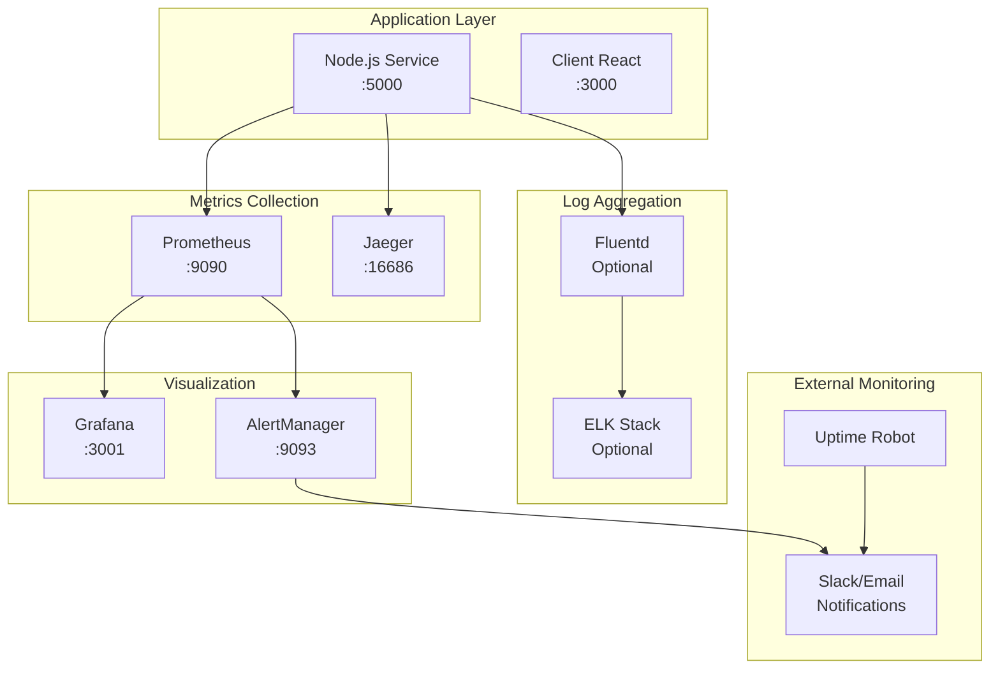

# Мониторинг и логирование Anime Site

## Архитектура мониторинга




## Prometheus метрики

### Системные метрики

В проекте используется библиотека `prom-client` для сбора метрик. Все метрики имеют префикс `anime_site_`.

```javascript
const client = require('prom-client');

// Настройка сбора метрик по умолчанию
const register = new client.Registry();

// Добавляем метрики по умолчанию
client.collectDefaultMetrics({
  register,
  prefix: 'anime_site_',
  gcDurationBuckets: [0.001, 0.01, 0.1, 1, 2, 5]
});

// HTTP запросы
const HTTP_REQUESTS_TOTAL = new client.Counter({
  name: 'anime_site_http_requests_total',
  help: 'Total HTTP requests',
  labelNames: ['method', 'endpoint', 'status_code']
});

// Время ответа HTTP запросов
const HTTP_REQUEST_DURATION = new client.Histogram({
  name: 'anime_site_http_request_duration_seconds',
  help: 'HTTP request duration in seconds',
  labelNames: ['method', 'endpoint'],
  buckets: [0.1, 0.25, 0.5, 1.0, 2.5, 5.0, 10.0]
});

// Активные соединения
const ACTIVE_CONNECTIONS = new client.Gauge({
  name: 'anime_site_active_connections',
  help: 'Number of active connections',
  labelNames: ['connection_type']
});

// WebSocket соединения
const WEBSOCKET_CONNECTIONS = new client.Gauge({
  name: 'anime_site_websocket_connections_active',
  help: 'Active WebSocket connections'
});

// WebSocket сообщения
const WEBSOCKET_MESSAGES = new client.Counter({
  name: 'anime_site_websocket_messages_total',
  help: 'Total WebSocket messages',
  labelNames: ['direction', 'message_type']
});

# Кеш метрики
CACHE_OPERATIONS = Counter(
    'anime_site_cache_operations_total',
    'Total cache operations',
    ['operation', 'cache_level', 'result']
)

CACHE_HIT_RATE = Gauge(
    'anime_site_cache_hit_rate',
    'Cache hit rate',
    ['cache_level']
)

CACHE_SIZE = Gauge(
    'anime_site_cache_size_bytes',
    'Cache size in bytes',
    ['cache_level']
)

# База данных метрики
DATABASE_OPERATIONS = Counter(
    'anime_site_database_operations_total',
    'Total database operations',
    ['operation', 'collection', 'result']
)

DATABASE_OPERATION_DURATION = Histogram(
    'anime_site_database_operation_duration_seconds',
    'Database operation duration in seconds',
    ['operation', 'collection'],
    buckets=[0.01, 0.05, 0.1, 0.25, 0.5, 1.0, 2.5]
)

DATABASE_CONNECTION_POOL = Gauge(
    'anime_site_database_connection_pool',
    'Database connection pool status',
    ['status']
)

# AniLibria API метрики
ANILIBRIA_API_REQUESTS = Counter(
    'anime_site_anilibria_api_requests_total',
    'Total requests to AniLibria API',
    ['endpoint', 'status_code']
)

ANILIBRIA_API_DURATION = Histogram(
    'anime_site_anilibria_api_request_duration_seconds',
    'AniLibria API request duration in seconds',
    ['endpoint'],
    buckets=[0.5, 1.0, 2.5, 5.0, 10.0, 30.0]
)

ANILIBRIA_API_RATE_LIMIT = Gauge(
    'anime_site_anilibria_api_rate_limit_remaining',
    'Remaining AniLibria API rate limit'
)

# Бизнес метрики
TITLES_SYNCED = Counter(
    'anime_site_titles_synced_total',
    'Total titles synchronized',
    ['source']
)

EPISODES_PROCESSED = Counter(
    'anime_site_episodes_processed_total',
    'Total episodes processed',
    ['action']
)

NOTIFICATIONS_SENT = Counter(
    'anime_site_notifications_sent_total',
    'Total notifications sent',
    ['type', 'channel']
)

# Ошибки и исключения
ERRORS_TOTAL = Counter(
    'anime_site_errors_total',
    'Total errors',
    ['error_type', 'component']
)

CIRCUIT_BREAKER_STATE = Gauge(
    'anime_site_circuit_breaker_state',
    'Circuit breaker state (0=closed, 1=open, 2=half-open)',
    ['service']
)
```

### Middleware для сбора метрик

```javascript
const metricsMiddleware = (req, res, next) => {
    const start = Date.now();
    
    // Увеличиваем счетчик активных соединений
    ACTIVE_CONNECTIONS.labels(connection_type='http').inc();
    
    // Обработка завершения запроса
    res.on('finish', () => {
        const duration = (Date.now() - start) / 1000;
        
        // Записываем метрики
        HTTP_REQUESTS_TOTAL.labels(
            method=req.method,
            endpoint=req.path,
            status_code=res.statusCode
        ).inc();
        
        HTTP_REQUEST_DURATION.labels(
            method=req.method,
            endpoint=req.path
        ).observe(duration);
        
        // Уменьшаем счетчик активных соединений
        ACTIVE_CONNECTIONS.labels(connection_type='http').dec();
    });
    
    // Обработка ошибок
    res.on('error', (error) => {
        ERRORS_TOTAL.labels(
            error_type=error.constructor.name,
            component='http_middleware'
        ).inc();
        
        // Уменьшаем счетчик активных соединений в случае ошибки
        ACTIVE_CONNECTIONS.labels(connection_type='http').dec();
    });
    
    next();
};
```

## Структурированное логирование

### Конфигурация логирования

```javascript
const winston = require('winston');
const { combine, timestamp, printf, colorize, json } = winston.format;

// Формат для разработки (цветной)
const developmentFormat = combine(
    colorize(),
    timestamp({ format: 'YYYY-MM-DD HH:mm:ss' }),
    printf(({ timestamp, level, message, ...meta }) => {
        return `${timestamp} [${level}]: ${message} ${Object.keys(meta).length ? JSON.stringify(meta, null, 2) : ''}`;
    })
);

// Формат для продакшена (JSON)
const productionFormat = combine(
    timestamp(),
    json()
);

// Создание логгера
const logger = winston.createLogger({
    level: process.env.LOG_LEVEL || 'info',
    format: process.env.NODE_ENV === 'production' ? productionFormat : developmentFormat,
    defaultMeta: { service: 'anime-site-service' },
    transports: [
        new winston.transports.Console(),
        // Можно добавить другие транспорты: файлы, distant API, Sentry и т.д.
    ],
});

// Middleware для добавления request_id и других контекстных данных
const loggingMiddleware = (req, res, next) => {
    const start = Date.now();
    
    // Добавляем request_id к логам
    req.logger = logger.child({
        request_id: req.headers['x-request-id'] || req.id,
        method: req.method,
        path: req.path,
        ip: req.ip,
        user_id: req.user?.id || 'anonymous'
    });
    
    // Логируем начало запроса
    req.logger.info('Request started', {
        user_agent: req.get('User-Agent'),
        content_type: req.get('Content-Type')
    });
    
    // Обработка завершения запроса
    res.on('finish', () => {
        const duration = Date.now() - start;
        req.logger.info('Request completed', {
            status_code: res.statusCode,
            duration_ms: duration
        });
    });
    
    next();
};
```

### Контекстное логирование

```javascript
const { v4: uuidv4 } = require('uuid');

// Middleware для добавления контекстного логирования
const contextLoggingMiddleware = (req, res, next) => {
    // Генерируем уникальный ID запроса
    const request_id = req.headers['x-request-id'] || uuidv4();
    
    // Добавляем request_id в заголовки ответа
    res.setHeader('X-Request-ID', request_id);
    
    // Получаем user_id из JWT токена если есть
    const user_id = req.user?.id || 'anonymous';
    
    // Добавляем контекст к логгеру
    const requestLogger = req.logger.child({
        request_id,
        user_id
    });
    
    // Логируем начало запроса
    requestLogger.info('Request started', {
        method: req.method,
        path: req.path,
        user_agent: req.get('User-Agent'),
        ip: req.ip
    });
    
    const start = Date.now();
    
    // Обработка завершения запроса
    res.on('finish', () => {
        const duration = Date.now() - start;
        
        requestLogger.info('Request completed', {
            status_code: res.statusCode,
            duration_ms: duration
        });
    });
    
    // Обработка ошибок
    res.on('error', (error) => {
        const duration = Date.now() - start;
        
        requestLogger.error('Request failed', {
            error: error.message,
            error_type: error.constructor.name,
            duration_ms: duration,
            stack: error.stack
        });
    });
    
    // Добавляем request_id и logger в объект запроса
    req.request_id = request_id;
    req.requestLogger = requestLogger;
    
    next();
};
```

### Логирование бизнес-событий

```javascript
class AnilibriaService {
    constructor(logger) {
        this.logger = logger.child({ service: 'anilibria' });
    }
    
    async syncTitle(titleId) {
        const startTime = Date.now();
        
        this.logger.info('Title sync started', {
            title_id: titleId,
            action: 'sync_title'
        });
        
        try {
            // Получение данных из API
            this.logger.debug('Fetching title from AniLibria API', {
                title_id: titleId
            });
            
            const titleData = await this.anilibriaClient.getTitle(titleId);
            
            // Сохранение в базу данных
            this.logger.debug('Saving title to database', {
                title_id: titleId,
                episodes_count: titleData.player?.list?.length || 0
            });
            
            await this.saveTitle(titleData);
            
            // Обновление кеша
            await this.updateCache(titleId, titleData);
            
            const duration = Date.now() - startTime;
            
            this.logger.info('Title sync completed successfully', {
                title_id: titleId,
                action: 'sync_title',
                episodes_count: titleData.player?.list?.length || 0,
                duration_ms: duration
            });
            
            // Метрика
            TITLES_SYNCED.labels(source='anilibria_api').inc();
            
            return titleData;
            
        } catch (error) {
            const duration = Date.now() - startTime;
            
            this.logger.error('Title sync failed', {
                title_id: titleId,
                action: 'sync_title',
                error: error.message,
                error_type: error.constructor.name,
                duration_ms: duration,
                stack: error.stack
            });
            
            ERRORS_TOTAL.labels({
                error_type: error.constructor.name,
                component: 'title_sync'
            }).inc();
            
            throw error;
        }
    }
}
```

## Distributed Tracing с Jaeger

### Настройка OpenTelemetry

```javascript
const { NodeTracerProvider } = require('@opentelemetry/sdk-trace-node');
const { JaegerExporter } = require('@opentelemetry/exporter-jaeger');
const { Resource } = require('@opentelemetry/resources');
const { SemanticResourceAttributes } = require('@opentelemetry/semantic-conventions');

// Настройка провайдера трассировки
const provider = new NodeTracerProvider({
    resource: new Resource({
        [SemanticResourceAttributes.SERVICE_NAME]: 'anime-site-service'
    })
});

// Настройка экспортера Jaeger
const jaegerExporter = new JaegerExporter({
    endpoint: process.env.JAEGER_AGENT_HOST || 'http://jaeger:14268/api/traces'
});

// Настройка процессора спанов
provider.addSpanProcessor(new BatchSpanProcessor(jaegerExporter));

// Регистрация провайдера
provider.register();

// Экспорт трейсера
const tracer = provider.getTracer('anime-site-service');
```

### Использование трассировки в коде

```javascript
const { trace } = require('@opentelemetry/api');

class AnilibriaService {
    async getTitleWithTracing(titleId) {
        const tracer = trace.getTracer('anime-site-service');
        
        return tracer.startActiveSpan('get_title', async (span) => {
            span.setAttribute('title_id', titleId);
            span.setAttribute('service.name', 'anime-site-nodejs');
            
            try {
                // Проверка кеша
                const cachedTitle = await tracer.startActiveSpan('cache_lookup', (cacheSpan) => {
                    cacheSpan.setAttribute('cache.level', 'memory');
                    
                    return this.getFromMemoryCache(titleId).then((result) => {
                        if (result) {
                            cacheSpan.setAttribute('cache.hit', true);
                            span.setAttribute('cache.source', 'memory');
                            return result;
                        }
                        
                        cacheSpan.setAttribute('cache.hit', false);
                        return null;
                    });
                });
                
                if (cachedTitle) {
                    span.end();
                    return cachedTitle;
                }
                
                // Проверка Redis
                const redisTitle = await tracer.startActiveSpan('redis_lookup', (redisSpan) => {
                    redisSpan.setAttribute('cache.level', 'redis');
                    
                    return this.getFromRedisCache(titleId).then((result) => {
                        if (result) {
                            redisSpan.setAttribute('cache.hit', true);
                            span.setAttribute('cache.source', 'redis');
                            return result;
                        }
                        
                        redisSpan.setAttribute('cache.hit', false);
                        return null;
                    });
                });
                
                if (redisTitle) {
                    span.end();
                    return redisTitle;
                }
                
                // Запрос к API
                const title = await tracer.startActiveSpan('anilibria_api_call', async (apiSpan) => {
                    apiSpan.setAttribute('external.service', 'anilibria.tv');
                    apiSpan.setAttribute('http.method', 'GET');
                    apiSpan.setAttribute('http.url', `/title?id=${titleId}`);
                    
                    try {
                        const result = await this.anilibriaClient.getTitle(titleId);
                        apiSpan.setAttribute('http.status_code', 200);
                        span.setAttribute('title.episodes_count', result.player?.list?.length || 0);
                        
                        // Сохранение в кеш
                        await tracer.startActiveSpan('cache_store', async (cacheSpan) => {
                            await this.storeInCache(titleId, result);
                            cacheSpan.end();
                        });
                        
                        apiSpan.end();
                        return result;
                        
                    } catch (error) {
                        apiSpan.setAttribute('error', true);
                        apiSpan.setAttribute('error.message', error.message);
                        apiSpan.setAttribute('http.status_code', 500);
                        apiSpan.end();
                        throw error;
                    }
                });
                
                span.end();
                return title;
                
            } catch (error) {
                span.recordException(error);
                span.setAttribute('error', true);
                span.setAttribute('error.message', error.message);
                span.end();
                throw error;
            }
        });
    }
}
```

## Grafana Dashboard

### Основные панели

```json
{
  "dashboard": {
    "title": "Anime Site Node.js Service",
    "panels": [
      {
        "title": "Request Rate",
        "type": "graph",
        "targets": [
          {
            "expr": "rate(anime_site_http_requests_total[5m])",
            "legendFormat": "{{method}} {{endpoint}}"
          }
        ]
      },
      {
        "title": "Response Time",
        "type": "graph",
        "targets": [
          {
            "expr": "histogram_quantile(0.95, rate(anime_site_http_request_duration_seconds_bucket[5m]))",
            "legendFormat": "95th percentile"
          },
          {
            "expr": "histogram_quantile(0.50, rate(anime_site_http_request_duration_seconds_bucket[5m]))",
            "legendFormat": "50th percentile"
          }
        ]
      },
      {
        "title": "Error Rate",
        "type": "graph",
        "targets": [
          {
            "expr": "rate(anime_site_http_requests_total{status_code=~\"4..|5..\"}[5m])",
            "legendFormat": "Error rate"
          }
        ]
      },
      {
        "title": "Cache Hit Rate",
        "type": "singlestat",
        "targets": [
          {
            "expr": "anime_site_cache_hit_rate",
            "legendFormat": "{{cache_level}}"
          }
        ]
      },
      {
        "title": "WebSocket Connections",
        "type": "graph",
        "targets": [
          {
            "expr": "anime_site_websocket_connections_active",
            "legendFormat": "Active connections"
          }
        ]
      },
      {
        "title": "Database Operations",
        "type": "graph",
        "targets": [
          {
            "expr": "rate(anime_site_database_operations_total[5m])",
            "legendFormat": "{{operation}} {{collection}}"
          }
        ]
      },
      {
        "title": "AniLibria API Status",
        "type": "graph",
        "targets": [
          {
            "expr": "rate(anime_site_anilibria_api_requests_total[5m])",
            "legendFormat": "{{endpoint}} - {{status_code}}"
          }
        ]
      },
      {
        "title": "Node.js Memory Usage",
        "type": "graph",
        "targets": [
          {
            "expr": "process_resident_memory_bytes{job=\"anime-site-nodejs\"}",
            "legendFormat": "Memory Usage"
          }
        ]
      },
      {
        "title": "Node.js Event Loop Latency",
        "type": "graph",
        "targets": [
          {
            "expr": "nodejs_eventloop_lag_seconds{job=\"anime-site-nodejs\"}",
            "legendFormat": "Event Loop Lag"
          }
        ]
      }
    ]
  }
}
```

## Алерты и уведомления

### Prometheus Alert Rules

```yaml
# alerts.yml
groups:
  - name: anime-site-nodejs-service
    rules:
      - alert: HighErrorRate
        expr: rate(anime_site_http_requests_total{status_code=~"5.."}[5m]) > 0.1
        for: 5m
        labels:
          severity: critical
        annotations:
          summary: "High error rate in Anime Site Node.js service"
          description: "Error rate is {{ $value }} errors per second"
      
      - alert: HighResponseTime
        expr: histogram_quantile(0.95, rate(anime_site_http_request_duration_seconds_bucket[5m])) > 5
        for: 5m
        labels:
          severity: warning
        annotations:
          summary: "High response time in Anime Site Node.js service"
          description: "95th percentile response time is {{ $value }} seconds"
      
      - alert: LowCacheHitRate
        expr: anime_site_cache_hit_rate < 0.7
        for: 10m
        labels:
          severity: warning
        annotations:
          summary: "Low cache hit rate"
          description: "Cache hit rate is {{ $value }}"
      
      - alert: ServiceDown
        expr: up{job="anime-site-nodejs"} == 0
        for: 1m
        labels:
          severity: critical
        annotations:
          summary: "Anime Site Node.js service is down"
          description: "Service has been down for more than 1 minute"
      
      - alert: DatabaseConnectionIssues
        expr: anime_site_database_connection_pool{status="available"} < 5
        for: 5m
        labels:
          severity: warning
        annotations:
          summary: "Low database connection pool"
          description: "Available connections: {{ $value }}"
      
      - alert: AnilibriaAPIDown
        expr: rate(anime_site_anilibria_api_requests_total{status_code=~"5.."}[5m]) > 0.5
        for: 5m
        labels:
          severity: critical
        annotations:
          summary: "AniLibria API is experiencing issues"
          description: "High error rate from AniLibria API"
      
      - alert: HighMemoryUsage
        expr: process_resident_memory_bytes{job="anime-site-nodejs"} > 500000000
        for: 5m
        labels:
          severity: warning
        annotations:
          summary: "High memory usage in Anime Site Node.js service"
          description: "Memory usage is {{ $value }} bytes"
      
      - alert: HighEventLoopLatency
        expr: nodejs_eventloop_lag_seconds{job="anime-site-nodejs"} > 0.1
        for: 5m
        labels:
          severity: warning
        annotations:
          summary: "High event loop latency in Anime Site Node.js service"
          description: "Event loop lag is {{ $value }} seconds"
```

### AlertManager конфигурация

```yaml
# alertmanager.yml
global:
  smtp_smarthost: 'localhost:587'
  smtp_from: 'alerts@anime-site.com'

route:
  group_by: ['alertname']
  group_wait: 10s
  group_interval: 10s
  repeat_interval: 1h
  receiver: 'web.hook'

receivers:
  - name: 'web.hook'
    slack_configs:
      - api_url: 'YOUR_SLACK_WEBHOOK_URL'
        channel: '#alerts'
        title: 'AniLibria Service Alert'
        text: '{{ range .Alerts }}{{ .Annotations.summary }}{{ end }}'
    
    email_configs:
      - to: 'admin@example.com'
        subject: 'AniLibria Service Alert'
        body: |
          {{ range .Alerts }}
          Alert: {{ .Annotations.summary }}
          Description: {{ .Annotations.description }}
          {{ end }}
```

## Health Checks

### Комплексный health check endpoint

```javascript
const express = require('express');
const router = express.Router();

/**
 * Комплексный health check endpoint
 * GET /health
 */
router.get('/health', async (req, res) => {
    const healthStatus = {
        status: 'healthy',
        timestamp: new Date().toISOString(),
        version: '1.0.0',
        checks: {}
    };
    
    // Проверка базы данных
    try {
        const dbResponseTime = await checkDatabase();
        healthStatus.checks.database = {
            status: 'healthy',
            response_time_ms: dbResponseTime
        };
    } catch (error) {
        healthStatus.checks.database = {
            status: 'unhealthy',
            error: error.message
        };
        healthStatus.status = 'unhealthy';
    }
    
    // Проверка Redis
    try {
        const redisResponseTime = await checkRedis();
        healthStatus.checks.redis = {
            status: 'healthy',
            response_time_ms: redisResponseTime
        };
    } catch (error) {
        healthStatus.checks.redis = {
            status: 'unhealthy',
            error: error.message
        };
        healthStatus.status = 'unhealthy';
    }
    
    // Проверка AniLibria API
    try {
        const apiStatus = await checkAnilibriaApi();
        healthStatus.checks.anilibria_api = apiStatus;
    } catch (error) {
        healthStatus.checks.anilibria_api = {
            status: 'unhealthy',
            error: error.message
        };
        // API недоступность не критична
    }
    
    // Проверка внутренних сервисов
    try {
        const nodejsStatus = await checkNodejsService();
        healthStatus.checks.nodejs_service = nodejsStatus;
    } catch (error) {
        healthStatus.checks.nodejs_service = {
            status: 'unhealthy',
            error: error.message
        };
    }
    
    // Проверка памяти Node.js
    try {
        const memoryStatus = await checkNodejsMemory();
        healthStatus.checks.memory = memoryStatus;
    } catch (error) {
        healthStatus.checks.memory = {
            status: 'unhealthy',
            error: error.message
        };
    }
    
    if (healthStatus.status === 'unhealthy') {
        return res.status(503).json(healthStatus);
    }
    
    res.json(healthStatus);
});

/**
 * Readiness check - сервис готов к работе
 * GET /ready
 */
router.get('/ready', async (req, res) => {
    const readinessStatus = {
        status: 'ready',
        timestamp: new Date().toISOString(),
        checks: {}
    };
    
    // Проверка только критических сервисов
    try {
        await checkDatabase();
        readinessStatus.checks.database = { status: 'ready' };
    } catch (error) {
        readinessStatus.checks.database = { status: 'not_ready' };
        readinessStatus.status = 'not_ready';
    }
    
    try {
        await checkRedis();
        readinessStatus.checks.redis = { status: 'ready' };
    } catch (error) {
        readinessStatus.checks.redis = { status: 'not_ready' };
        readinessStatus.status = 'not_ready';
    }
    
    if (readinessStatus.status === 'not_ready') {
        return res.status(503).json(readinessStatus);
    }
    
    res.json(readinessStatus);
});

/**
 * Liveness check - сервис жив
 * GET /live
 */
router.get('/live', (req, res) => {
    res.json({
        status: 'alive',
        timestamp: new Date().toISOString(),
        uptime: process.uptime()
    });
});

// Вспомогательные функции
async function checkDatabase() {
    const startTime = Date.now();
    try {
        // Простой запрос к базе данных
        await db.command('ping');
        return Date.now() - startTime;
    } catch (error) {
        throw new Error(`Database check failed: ${error.message}`);
    }
}

async function checkRedis() {
    const startTime = Date.now();
    try {
        // Проверка Redis соединения
        await redis.ping();
        return Date.now() - startTime;
    } catch (error) {
        throw new Error(`Redis check failed: ${error.message}`);
    }
}

async function checkAnilibriaApi() {
    const startTime = Date.now();
    try {
        const response = await fetch('https://api.anilibria.tv/v3/title/random', {
            timeout: 5000
        });
        
        const responseTime = Date.now() - startTime;
        
        if (response.ok) {
            return {
                status: 'healthy',
                response_time_ms: responseTime
            };
        } else {
            return {
                status: 'degraded',
                response_time_ms: responseTime,
                status_code: response.status
            };
        }
    } catch (error) {
        return {
            status: 'unhealthy',
            error: error.message,
            response_time_ms: Date.now() - startTime
        };
    }
}

async function checkNodejsService() {
    try {
        // Проверка event loop
        const eventLoopLag = process.hrtime();
        
        // Проверка памяти
        const memoryUsage = process.memoryUsage();
        
        return {
            status: 'healthy',
            event_loop_lag_ms: eventLoopLag[1] / 1000000,
            memory_usage_bytes: memoryUsage.heapUsed,
            uptime_seconds: process.uptime()
        };
    } catch (error) {
        return {
            status: 'unhealthy',
            error: error.message
        };
    }
}

async function checkNodejsMemory() {
    try {
        const memoryUsage = process.memoryUsage();
        const heapLimit = require('v8').getHeapStatistics().heap_size_limit;
        const heapUsage = memoryUsage.heapUsed;
        const heapUsagePercent = (heapUsage / heapLimit) * 100;
        
        return {
            status: heapUsagePercent < 90 ? 'healthy' : 'warning',
            heap_usage_bytes: heapUsage,
            heap_limit_bytes: heapLimit,
            heap_usage_percent: heapUsagePercent
        };
    } catch (error) {
        return {
            status: 'unhealthy',
            error: error.message
        };
    }
}

module.exports = router;
```

Эта система мониторинга обеспечивает полную наблюдаемость Python сервиса с детальными метриками, структурированным логированием, distributed tracing и автоматическими алертами.
Эта система мониторинга обеспечивает полную наблюдаемость Node.js сервиса с детальными метриками, структурированным логированием, distributed tracing и автоматическими алертами.